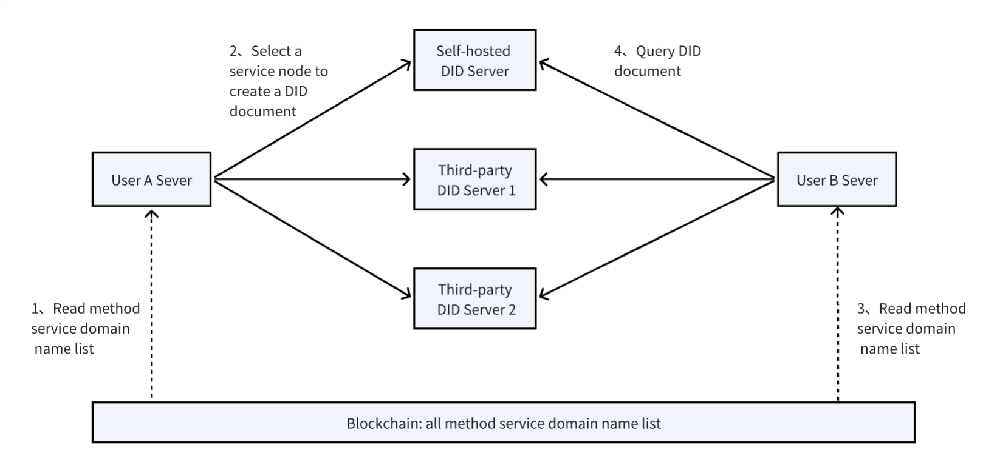
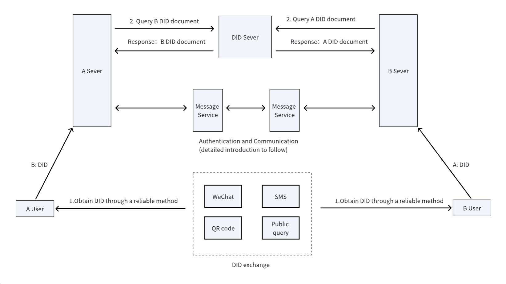

# AgentNetworkProtocol技术白皮书：一种基于DID的跨平台身份认证和端到端加密通信技术

作者：常高伟，chgaowei@gmail.com  
官网：[https://agent-network-protocol.com/](https://agent-network-protocol.com/)  
github：[https://github.com/chgaowei/AgentConnect](https://github.com/chgaowei/AgentConnect)  

备注：  
如果你想快速了解我们技术概要，可以先看这篇文章： [技术通俗介绍](https://egp0uc2jnx.feishu.cn/wiki/NS9qwPzNeiIlmmkGAP7cIwN0nZg) 、[技术介绍精简版](https://egp0uc2jnx.feishu.cn/wiki/Qg3DwA0VuiHAC6k7ubicZGJHndd)。  
如果你想了解我们全面的文档，可以从这里进入： [AgentConnect技术文档](https://egp0uc2jnx.feishu.cn/wiki/BqYiwiblRiu81FkQNUfcfaIwniK)。  

## 摘要  

本文提出了一种基于去中心化标识符（DID）和端到端加密通信技术，旨在解决当前智能体跨平台身份认证和安全通信的难题。通过结合W3C DID规范、区块链技术和TLS协议，本文设计了一种低成本、高效且安全的跨平台身份认证和加密通信方案。该方案引入了一种名为“all”的DID方法，使得智能体可以在不同平台间实现身份互操作性，并通过HTTPS等标准协议进行身份认证。文中详细描述了DID文档的生成与验证过程，以及基于DID的端到端加密通信机制，强调了高效、安全的短期密钥协商和加密通信流程。最后，本文探讨了智能体协作网络的未来发展方向和基于DID的身份系统的广泛应用前景。  

## 1. 引言  

智能体将成为继Android、iOS之后的下一个重要平台，未来个人、组织、企业等不同主体，都将拥有一个智能体来为自己提供服务。一个智能体无法独立存在，它需要和其他智能体协作满足人的需求。比如个人助理也是一个智能体，它需要衣食住行等生活相关智能体提供生活服务，而一个服装店铺的智能体，则需要和它的上下游比如生产、设计、渠道等各种智能体紧密协作。一个由智能体组成的协作网络，将会是下一代互联网的重要组成部分，能够为人们提供更加智能的服务。  

智能体网络的高效运转，需要智能体相互之间建立连接，需要智能体能够找到彼此，进行身份认证，进行安全的加密通信，并且使用标准协议进行高效协作。  

当前智能体的大多都依赖平台的身份ID，不同平台之间身份系统无法打通，智能体之间无法低成本的进行跨平台连接。同时，当前的安全通信方案（如TLS）大部分用于客户端和服务端之间的通信，且依赖认证机构签发CA（Certificate Authority）证书，目前暂时没有非常理想的方案，让智能体之间进行低成本、高效、安全的加密通信。  

基于此，结合W3C DID(Decentralized Identifier)规范、区块链技术、TLS（Transport Layer Security）技术，本文提出了一个低成本的打通不同平台身份ID的方案，以及能够让智能体进行低成本、高效、安全的加密通信的方案，同时也提出了一个智能体基于协议相互协作的设想。  

## 2. 基于DID的跨平台身份认证  

W3C DID（Decentralized Identifier，去中心化标识符，[2]）是一种新型的标识符标准，旨在解决传统中心化身份管理系统中心化依赖、隐私和数据控制、互操作性、安全性等问题。  

我们基于W3C DID规范提出的身份认证方案，设计了一个新的DID方法，它重点利用了DID在互操作性方面的优势，简化了身份验证过程，解决不同的中心化系统之间缺乏互操作性，身份验证复杂且冗长的问题。  

### 2.1 DID方法all（Alliance）  

DID方法（DID Method）是去中心化标识符（Decentralized Identifier, DID）的一种实现方式，规定了如何创建、解析、更新和撤销DID。每个DID方法都与特定的区块链或去中心化网络关联，并且定义了与该网络交互的具体规则。  

现有已经定义的DID方法大部分基于区块链设计，受限于区块链技术阶段，在扩展性、商业化落地上存在非常大的问题。基于web的DID方法则和域名深度绑定，需要web服务提供者支持DID的相关操作，对web服务提供者带来一定的复杂度。  

我们提出了一个新的DID方法all（Alliance，联盟），类似区块链中的联盟链，即所有支持此方法标准的服务提供商，都可以对外提供DID的相关服务。DID的使用者可以根据所有服务提供商的价格、服务水平、口碑等，选择一个或多个提供服务。所有支持此方法的服务提供商可以将自己的服务域名写入到区块链一个特定内存上，以保证所有all方法的使用者能够得到完整的服务提供商列表。  

同时，DID的创建者也可以在DID中指定DID文档的托管服务域名，以告知DID查询者去特定服务商或者用户自己搭建的服务器中获取DID文档。  

最后，all方法的操作全部使用https等标准的web协议，以让all方法能够利用已有的web基础设施。  

### 2.2 all方法的设计  

all方法设计的核心是用密码学技术来保证DID文档的不可篡改性，用联盟节点来保证系统的分布式。  

all方法的创建、解析、更新和撤销DID等操作全部使用https方法，核心流程如下：  



1. 用户A首先从区块链等分布式存储中读取all方法三方服务域名列表，或者使用自建DID服务。  

2. 创建DID和DID文档，选择其中一个或多个节点，发起HTTP请求，托管DID文档。  

3. 用户B也从区块链等分布式存储中读取all方法服务域名列表。  

4. 使用轮询或并发查询的方式，从服务域名节点中，查询DID文档。  

DID all方法设计规范：[02-did:all方法设计规范](02-did:all方法设计规范.md)  

### 2.3 DID与DID文档  

我们使用的DID文档示例如下（详细描述参见：[02-did:all方法设计规范](02-did:all方法设计规范.md)）： 

```json
{
  "@context": "https://www.w3.org/ns/did/v1",
  "id": "did:all:14qQqsnEPZy2wcpRuLy2xeR737ptkE2Www@example.com:443",
  "verificationMethod": [
    {
      "id": "did:all:14qQqsnEPZy2wcpRuLy2xeR737ptkE2Www@example.com:443#keys-1",
      "type": "EcdsaSecp256r1VerificationKey2019",
      "controller": "did:all:14qQqsnEPZy2wcpRuLy2xeR737ptkE2Www@example.com:443",
      "publicKeyHex": "04b11e73474896ad9e4b1a2d5a1190d5b25a916eb62f3d1db155bb64dc046bfb3868457a1912c8f9fcd603ff5b1078f883f6bf6b9f0dee60bad9e57e7fec9b439d"
    }
  ],
  "service": [
    {
      "id": "did:all:14qQqsnEPZy2wcpRuLy2xeR737ptkE2Www@example.com:443#communication",
      "type": "messageService",
      "router": "did:all:14qQqsnEPZy2wcpRuLy2xeR737ptkE2Www@example.com:443",
      "serviceEndpoint": "wss://example.com/endpoint"
    },
    {
      "id": "did:all:14qQqsnEPZy2wcpRuLy2xeR737ptkE2Www@example.com:443#didservice",
      "type": "didDocumentService",
      "serviceEndpoint": "https://example.com/endpoint"
    }
  ],
  "proof": {
    "type": "EcdsaSecp256r1Signature2019",
    "created": "2024-05-27T10:51:55Z",
    "proofPurpose": "assertionMethod",
    "verificationMethod": "did:all:14qQqsnEPZy2wcpRuLy2xeR737ptkE2Www@example.com:443#keys-1",
    "proofValue": "z58DAdFfa9SkqZMVPxAQpic7ndSayn1PzZs6ZjWp1CktyGesjuTSwRdoWhAfGFCF5bppETSTojQCrfFPP2oumHKtz"
  }
}
```

其中，DID是“did:all:14qQqsnEPZy2wcpRuLy2xeR737ptkE2Www@example.com:443”。  

在all方法中，唯一标识符是根据verificationMethod中的公钥生成的，生成过程参考了比特币地址的生成方式。这种方法的好处是，不需要第三方（比如CA机构）参与，就可以验证did文档中公钥是否与did对应。比如：  

- 验证者读取一个did文档，首先判断did是否是正确（通过安全渠道获得）；  

- 然后看根据公钥生成did是否与文档中的did相同，如果相同，则说明公钥是正确的；  

- 再根据公钥验证did文档proof中的签名信息，如果校验成功，则说明did文档未被篡改。  

这是一个防止DID文档被篡改的高效且低成本的方案，也能够防止DID文档托管服务私自修改DID文档。  

如果用户公钥对应的私钥泄露，用户可以触发对应的DID撤销以及DID更新流程，通知相关方更新DID。  

### 2.4 跨平台身份认证过程  

基于DID的跨平台身份认证方面，不需要使用者抛弃他们原有的身份系统，DID可以仅用作两个系统之间的身份认证，原有系统内部逻辑可以保持不变。比如，可以为一个用户申请一个或多个DID，绑定到原有的身份ID之上。  

假设有两个用户，分别是A和B，他们分别注册在平台A和平台B，下面描述A和B如何找到对方的DID文档，获取消息服务并进行通信的过程：  



流程说明：  

1. 用户A和B首先通过可靠途径交互DID，比如通过当面扫描、短信微信、公共查询等。  

2. 用户A和B将对方的DID发送给各自服务端，服务端通过DID查询DID 文档。  

3. 根据返回的DID文档，校验ID、公钥、签名是否正确。如果正确，说明DID文档未被篡改，则取出消息服务端点，并发起加密通信流程。  

### 3. 端到端加密通信  

本章节描述，持有DID的双方在互相校验身份后，如何进行安全、高效的端到端的通信。在双方通信中，安全至关重要，过程中需要保证数据加密、数据完整性、前向保密、防中间人攻击、防重放攻击等。  

#### 3.1 方案概述  

该方案借鉴了TLS、区块链（比特币）等已经在实践中得到检验的高安全性技术，对这些技术进行组合，得出一个新基于DID的端到端加密通信方案。  

我们基于WSS协议之上设计了一套基于DID的消息路由机制以及短期密钥协商机制，持有DID的双方可以使用DID文档中的公钥与自己的私钥，使用ECDHE（Elliptic Curve Diffie-Hellman Ephemeral）进行短期密钥协商，之后在密钥有效期内使用密钥加密消息实现安全通信。ECDHE能够保证消息即便经过三方消息代理等中间人转发，仍然无法被恶意解密。  

三方的Message service可能不存在，用户可以使用自己的消息服务。  


我们第一个版本基于WSS设计端到端加密方案，主要的考虑是WSS在互联网中应用非常广泛，有非常多可用的基础设施，能够降低用户的接入成本，这对方案的早期推广至关重要。  

后面我们会推出传输层（基于TCP or UDP）的端到端加密方案，因为基于WSS的一个问题是消息可能会被加解密两次，WSS内部已经包含了一次TLS加解密。  

#### 3.2 加密通信流程  

假如有两个平台的用户，一个是A（DID-A），一个是B（DID-B），A和B都可以通过DID SERVER获得对方的DID文档，did文档中，包含各自的公钥。  

A和B要进行加密通信，首先需要发起创建短期密钥流程。创建短期密钥的过程和TLS生产临时加密密钥的过程类似，这个密钥有一个有效期，在邻近失效前，需要再次发起创建短期密钥流程，生成新的密钥并更新。  

当A和B持有协商后的短期密钥后，如果A想发送消息给B，可以用密钥对消息进行加密，然后使用消息发送协议，通过message server发送给B。B收到后，根据密钥ID，找到之前存储的密钥，然后对加密消息进行解密。如果未找到对应的密钥，或者密钥已经过期，则发送错误消息，通知A发起更新短期密钥流程，短期密钥更新后，再次发送消息。 
```plain
Client (A)                                      Client (B)
|                                                 |
| -- Initiate Short-term Key Creation Process --> |
|                                                 |
|      (Create Temporary Encryption Key)          |
|                                                 |
| <---- Temporary Key Created ----                |
|                                                 |
|       (Key has an expiration time)              |
|                                                 |
|      (Monitor Key Validity)                     |
|                                                 |
|   (Before expiration, restart creation process) |
|                                                 |
| (A and B now have a negotiated short-term key)  |
|                                                 |
| ---- Encrypted Message ---->                    |
|                                                 |
|     (Encrypt message using short-term key)      |
|     (Send via message server)                   |
|                                                 |
| <---- Receive Encrypted Message ----            |
|                                                 |
|     (Find stored key using key ID)              |
|     (Decrypt message)                           |
|      (If key not found or expired)              |
|                                                 |
| <---- or Error Message ----                     |
|                                                 |
|      (Notify A to update short-term key)        |
|                                                 |
```

#### 3.3 短期密钥协商过程

短期密钥创建过程和TLS1.3中交换加密密钥过程基本类似，不同点有以下几点：

- 整个流程只有三个个消息，SourceHello、DestinationHello、Finished，分别对应TLS的ClientHello和SeverHello、Finished。因为在我们的流程中，没有客户端和服务端，只有源和目的。

- 其他消息的比如EncryptedExtensions、Certificate、CertificateVerify都不需要。其中：

  - EncryptedExtensions暂时不要，后面可能会添加，用来传递加密扩展。

  - Certificate、CertificateVerify不需要。因为这两个消息的主要目的是保证服务端的公钥是安全的，我们通过DID地址和公钥的对应关系来验证DID对应公钥的正确性，即一个公钥确定，那它有且只有一个DID；一个DID确定，那它有且只有一个公钥。

- Finished不再对握手消息进行哈希和加密，因为SourceHello和DestinationHello中已经包含了各自的签名，能够保证消息的完整性。

- Source和Destination之间可以同时发起多个短期密钥协商，同一时间可以存在多个密钥，用于不同类型的消息加密中。

整体流程图如下：
```plain
Client (A)                                          Server (B)
   |                                                    |
   |  ---------------- SourceHello ---------------->    |
   |                                                    |
   |         (Include public key and signature)         |
   |                                                    |
   |                                                    |
   |  <------------- DestinationHello ------------      |
   |                                                    |
   |         (Include public key and signature)         |
   |                                                    |
   |                                                    |
   |  -------- Finished (Include verify_data) ------->  |
   |                                                    |
   |  <-------- Finished (Include verify_data) -------- |
   |                                                    |
   |                                                    |
```

短期密钥协商过程：[03-基于did:all方法的端到端加密通信技术协议](03-基于did:all方法的端到端加密通信技术协议.md)

## 4. 展望

### 4.1 基于协议的智能协作

虽然本文未讨论通信中协议的具体设计，但是它对智能体组成一个协作网络至关重要。

随着大语言模型技术的发展，软件系统对自然语言的理解能力得到了极大的增强，人们普遍能够看到他对人机交互产生的巨大影响，自然语言可能成为人机交互的重要交互接口。那自然语言是否会成为软件之间重要的交互语言？我们认为这是一个非常有意思的课题。

传统的软件系统之间，比如提供语音通话的运营商软件之间、提供互联网服务的应用之间，一般会使用定义严格的二进制或文本协议作为交互语言，如果一方未严格遵循标准，就既有可能会导致双方交互失败，这个时候一般需要程序员手动修改bug并重新发布代码。

当AI能够理解自然语言，并且能够自动生成代码的时候，我们是否可以定义一个更加宽泛的交互协议，并在协议用自然语言对字段进行详细描述，以便AI能够准确理解协议。两个系统首次对接联调的过程也可以由AI来完成，AI根据协商确定双方认可的具体字段，修改代码以适配双方协商的协议，自动测试、修复bug、验证结果，最终低成本的完成两个系统对接。

### 4.2 技术实现建议

我们设计的方案，充分的考虑了用户的自主选择权，用户可以选择使用三方的DID托管服务、消息服务等，也可以使用自己搭建的服务，两种方案在安全性上没有区别。

如果用户自己搭建服务，在实现上需要考虑灾备、扩展性、安全性（防dos防重放等攻击）等重要特性。

出于开发成本、运维成本的考虑，我们推荐用户特别是中小用户使用专业的三方服务。

### 4.3 DID原生身份系统

本文中我们仅将DID用于跨平台身份认证，但是我们认为DID未来的用途远不止于此，我们希望看到未来能够出现一个DID原生的身份系统，彻底解决传统中心化身份管理系统中心化依赖、隐私和数据控制、互操作性、安全性等问题。

### 4.4 多媒体格式支持

目前协议设计上，暂时只支持传递文本内容。互联网上存在大量的多媒体内容，比如音频、视频、文件，还有实时音视频内容如直播、RTC等。

这些格式的媒体内容，我们未来都将会支持。这样智能体之间可以进行更加全面的协作。

### 4.5 基于区块链的去中心化方案

我们设计的DID本质上相当于区块链地址，它也可以用作区块链的钱包地址。这样，基于区块链来构建一个完全去中心化的身份系统就成为一个选项。我们可以将DID文档发布到区块链上，让任何人都能够查询；在区块链创建业务相关的token，用于实现基于DID的交易和结算，让智能体的价值传递变的更方便；将分布式的算力使用区块链组织起来，形成一个去中心化的智能体消息服务网络。未来应该还有更多的可能。

### 4.6 二进制通信协议

当前的通信协议以wss+json为主，对比TLS的二进制协议，在效率上具有天然的劣势。考虑到我们的目标是成为未来的基础设施，我们未来会开发基于传输层的二进制格式的协议。

## 5. 总结

本文介绍了一种创新的基于DID的跨平台身份认证和端到端加密通信方案，旨在应对智能体网络中身份验证和安全通信的挑战。通过引入DID的“all”方法，本文解决了不同平台间身份系统互操作性的问题，简化了身份验证过程。该方案利用HTTPS协议和区块链技术，保证了DID文档的不可篡改性和系统的分布式特性。同时，通过借鉴TLS和区块链的技术，设计了高效、安全的短期密钥协商机制，实现了端到端的加密通信，确保了数据的保密性和完整性。本文还提出了智能体网络协作的设想，探讨了未来基于DID的身份系统的潜在应用和发展方向。总的来说，本文提供了一种具有广泛应用前景的解决方案，为智能体网络的高效、安全运转奠定了基础。


## 参考文献
[1] 比尔盖茨，AI is about to completely change how you use computers，[https://www.gatesnotes.com/AI-agents](https://www.gatesnotes.com/AI-agents)

[2] W3C DID(Decentralized Identifier)规范，[https://www.w3.org/TR/did-core/](https://www.w3.org/TR/did-core/)

[3] TLS(Transport Layer Security)1.3规范，[https://www.rfc-editor.org/info/rfc8446](https://www.rfc-editor.org/info/rfc8446)

[4] DID all方法设计规范，[02-did:all方法设计规范](02-did:all方法设计规范.md)

[5] 基于DID的端到端加密通信技术，[03-基于did:all方法的端到端加密通信技术协议](03-基于did:all方法的端到端加密通信技术协议.md)
