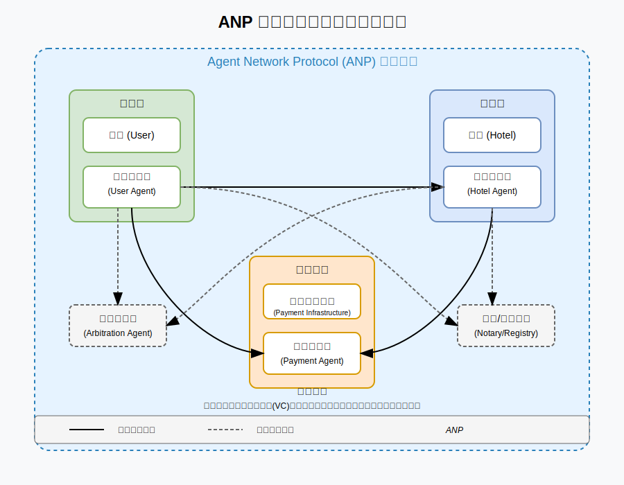

# 智能体点对点交易流程与协议设计：通俗易懂版

## 方案要解决的问题

随着人工智能技术的迅猛发展，智能体（AI Agent）正在迅速普及，它们将越来越多地代替人类访问互联网、处理信息和执行任务。在这个智能体激增的时代，一个新的交互范式正在形成。

未来的互联网可能不再是人与人、人与网站之间的交互，而是智能体与智能体之间的直接连接和通信。这种点对点的智能体交互方式将比传统的中介模式更加高效，能够减少中间环节，加速信息传递和决策过程。

然而，互联网本质上是一个不可信的环境，当智能体代表用户进行交易时，面临以下核心挑战：

- **身份验证**：如何确保交互的智能体身份真实可靠？
- **信息真实性**：如何验证智能体交换的信息未被篡改？
- **交易安全**：如何在没有中央平台的情况下确保交易过程安全？
- **争议解决**：当交易出现问题时，如何有效处理争议？

因此，设计一个安全、高效、直观的智能体点对点交易方案变得尤为重要，这是智能体经济发展的基础设施。

## 解决方案概述

我们提出了一个基于智能体技术的交易框架，利用Agent Network Protocol (ANP)作为基础，构建一个分布式的、安全的交易生态系统。

### 核心技术

1. **Agent Network Protocol (ANP)**：智能体之间通信的基础协议，类似于人工智能时代的"HTTP"
2. **去中心化标识符 (DIDs)**：为每个参与方提供独特的数字身份
3. **可验证凭证 (VCs)**：交换可验证的数据声明，确保信息的真实性和完整性
4. **VC哈希链**：通过哈希值链接各个凭证，形成不可篡改的交易记录

### 系统架构



*图1：ANP智能体点对点交易系统架构图 - 展示了用户、酒店、支付系统及可选的仲裁与公证服务之间的交互关系。所有智能体间通信均基于ANP协议，通过可验证凭证(VC)进行信息传递与验证。*

在这个架构中，各方都由其专属智能体代表，包括：

- **用户智能体**：代表消费者，管理用户身份和交易流程
- **酒店智能体**：代表服务提供商，提供服务信息和处理预订
- **支付智能体**：管理资金托管和交易结算
- **仲裁智能体**（可选）：在出现争议时提供中立的调解和裁决
- **认证/注册服务**（可选）：提供一个可信的第三方服务，用于存储和证明酒店/产品信息的哈希值或其他关键属性，供VC引用

### 交易流程：智能体如何完成一次预订交易

让我们用一个生活中的例子来说明智能体如何协作完成一次酒店预订。想象一下，张先生想要预订一家酒店。在传统方式下，他需要登录预订平台、搜索酒店、填写信息并付款。而在智能体网络中，整个流程由他的个人智能体自动处理，直接与酒店和支付智能体交互。

#### 1. 搜索与报价

张先生告诉他的智能体："帮我预订下周五在市中心的一家酒店"。

- 用户智能体在网络中寻找合适的酒店智能体
- 发送具体需求（日期、地点、房型等）
- 酒店智能体检查库存和价格
- 酒店智能体生成"订单提议凭证"（相当于电子合同），包含房型、价格、取消政策等信息
- 酒店智能体用自己的私钥对凭证进行数字签名，确保内容不可篡改
- 这份凭证通过ANP协议发送给用户智能体

这一步中，酒店会临时锁定房间，等待用户确认。

#### 2. 确认预订

用户智能体收到报价后，展示给张先生。张先生同意预订条款：

- 用户智能体创建"预订确认凭证"，表示接受条款
- 这份凭证包含对原始订单提议的引用（通过哈希值链接），确保双方看到的是同一份合同
- 用户智能体用张先生的私钥签名
- 将签名后的确认凭证发送给酒店智能体
- 酒店智能体验证凭证的有效性，将订单状态更新为"待付款"

#### 3. 支付流程启动

现在需要处理付款，但为了安全起见，不直接支付给酒店：

- 酒店智能体创建"支付请求凭证"发送给支付智能体（如某支付平台）
- 这份凭证仅包含必要的支付信息（金额、币种、收款方ID等），不包含详细的酒店信息，保护用户隐私
- 支付请求凭证也包含对预订确认凭证的哈希引用，形成完整的证据链

#### 4. 支付指令生成

支付智能体收到请求后：

- 生成"支付指令凭证"，包含支付链接或二维码等实际支付方式
- 将这份凭证先发给酒店智能体，再由酒店转发给用户智能体
- 用户可以通过这个链接或二维码完成支付

#### 5. 资金托管

张先生通过智能体收到支付信息，并完成支付：

- 资金不会直接到酒店账户，而是先进入支付平台的"托管账户"
- 支付智能体确认收到资金后，生成"资金托管凭证"
- 这份凭证发送给用户和酒店，相当于告诉双方："钱已安全存放，服务完成后才会释放"

#### 6. 服务履行

酒店看到资金已托管，正式确认预订成功：

- 酒店锁定房间资源，可能会发送"预订完成凭证"给用户
- 张先生按约定时间入住酒店，享受服务
- 服务结束后，酒店可能会发送"服务完成通知"给用户智能体

#### 7. 确认与结算

张先生离店后：

- 用户智能体确认服务是否满意
- 如满意，智能体生成"服务完成确认凭证"发送给支付智能体
- 如果用户在规定时间内未确认也未提出异议，系统可能自动确认完成

#### 8. 最终结算

支付智能体收到确认后：

- 将托管资金划转给酒店账户
- 生成"资金释放凭证"告知交易各方
- 整个交易圆满完成

如果交易过程中出现任何问题，比如服务质量不满意，系统也设计了争议解决机制，可以引入仲裁智能体进行调解。

**理想状态下流程图：**

```mermaid
sequenceDiagram
    participant U as 用户智能体(User Agent)
    participant H as 酒店智能体(Hotel Agent)
    participant P as 支付智能体(Payment Agent)
    participant R as 公证/注册服务(Registry)
    
    Note over U,H: 步骤1: 用户搜索与选择
    U->>H: 服务发现请求
    H-->>U: 提供服务信息
    
    Note over U,H: 步骤2: 用户请求预订
    U->>H: 发送预订请求(BookingRequest)
    
    Note over H: 步骤3: 生成订单提议
    H-->>R: （可选）查询产品信息的哈希和URL
    R-->>H: 返回验证过的产品信息哈希和URL
    rect rgb(230, 255, 204)
        Note right of H: 【订单提议凭证】OrderProposalCredential<br/>(包含公证服务产品信息的哈希和URL)
    end
    H-->>U: 发送订单提议凭证
    
    Note over U: 步骤4: 用户确认订单
    rect rgb(213, 232, 252)
        Note right of U: 【订单确认凭证】BookingConfirmationCredential<br/>(包含OrderProposal的哈希)
    end
    U->>H: 发送订单确认凭证
    
    H->>P: 发送付款请求
    
    Note over P: 生成支付指令
    rect rgb(255, 242, 204)
        Note right of P: 【支付指令凭证】PaymentInstructionCredential<br/>(包含BookingConfirmation的哈希)
    end
    P-->>H: 发送支付指令凭证
    H-->>U: 转发支付指令凭证
    
    Note over U,P: 步骤5: 用户付款与资金托管
    U->>P: 完成支付操作
    
    Note over P: 资金托管
    rect rgb(255, 242, 204)
        Note right of P: 【资金托管凭证】FundsEscrowedCredential<br/>(包含PaymentInstruction的哈希)
    end
    P-->>U: 发送资金托管凭证
    P-->>H: 发送资金托管凭证
    
    Note over H: 步骤6: 酒店确认与服务履约
    rect rgb(230, 255, 204)
        Note right of H: 【预订完成凭证(可选)】BookingFinalizedCredential<br/>(包含FundsEscrowed的哈希)
    end
    H-->>U: 发送预订完成凭证(可选)
    
    Note over H: 提供服务
    H-->>U: 服务完成通知
    
    Note over U: 步骤7: 用户确认放款
    rect rgb(213, 232, 252)
        Note right of U: 【服务完成确认凭证】ServiceCompletionConfirmationCredential<br/>(包含FundsEscrowed或BookingFinalized的哈希)
    end
    U->>P: 发送服务完成确认凭证
    
    Note over P: 步骤8: 结算结束
    rect rgb(255, 242, 204)
        Note right of P: 【资金释放凭证】FundsReleasedCredential<br/>(包含ServiceCompletionConfirmation的哈希)
    end
    P-->>U: 发送资金释放凭证
    P-->>H: 发送资金释放凭证
    P->>H: 资金划转至酒店账户
```

*图2：ANP智能体理想交易流程图 - 展示了从用户搜索到结算完成的完整流程，明确标记了凭证生成环节（VC标记），并清晰展现了用户智能体、酒店智能体和支付智能体之间的交互过程。*

**核心状态转换图 (概念):**
```stateDiagram-v2
    [*] --> 新建(New)
    新建(New) --> 待付款(Pending_Payment): 用户确认 (凭证包含订单提议哈希)
    待付款(Pending_Payment) --> 已托管(Escrowed): 资金托管 (凭证包含支付指令哈希)
    待付款(Pending_Payment) --> 已取消(Cancelled): 支付超时 / 用户取消
    已托管(Escrowed) --> 履约中(In_Service): 酒店确认预订 (可选凭证包含托管凭证哈希)
    已托管(Escrowed) --> 已取消(Cancelled): 用户取消 (符合政策)
    已托管(Escrowed) --> 争议中(In_Dispute): 发起争议 (凭证包含托管凭证哈希)
    履约中(In_Service) --> 待结算(Pending_Settlement): 用户确认服务 (凭证包含托管/预订完成凭证哈希) / 自动确认超时
    履约中(In_Service) --> 争议中(In_Dispute): 发起争议 (凭证包含履约中状态哈希)
    待结算(Pending_Settlement) --> 已结算(Settled): 资金释放 (凭证包含服务完成确认哈希)
    待结算(Pending_Settlement) --> 争议中(In_Dispute): 发起争议 (凭证包含待结算状态哈希)
    争议中(In_Dispute) --> 已结算(Settled): 仲裁决定 (凭证) -> 释放资金
    争议中(In_Dispute) --> 已取消(Cancelled): 仲裁决定 (凭证) -> 退款
    已取消(Cancelled) --> [*]
    已结算(Settled) --> [*]
```

### 关键技术：VC哈希链

在智能体网络中进行交易时，我们面临一个核心问题：**如何确保交易历史真实完整，不被篡改？**传统系统依赖中心化平台（如银行或预订平台）保存交易记录，但在分布式智能体环境中，没有这样的"可信第三方"。

VC哈希链技术巧妙地解决了这个问题。它的工作原理有点像"数字拼图"：

- 每个交易凭证（如订单、确认单、支付凭证等）都包含前一个凭证的"数字指纹"（哈希值）
- 这创建了一条不可破坏的证据链，任何人更改历史记录都会导致后续所有凭证验证失败
- 即使没有中心化平台，任何参与者都能验证整个交易历史是否完整真实，并且自己保存，必要的时候出示

这项技术使得智能体之间能够在没有中央平台的情况下建立信任，确保交易的透明性和安全性，为智能体经济提供了坚实的基础。


*图4：ANP协议中的VC哈希链 - 展示了从订单提议到最终结算的完整凭证链，每个凭证通过包含前一个凭证的哈希值形成不可篡改的链式结构，确保了交易的完整性和可验证性。*

凭证链关键特点：
1. **全流程追溯**：从最终的资金释放凭证可以通过哈希链一直追溯到最初的订单提议
2. **防篡改机制**：任何环节的凭证被修改都会导致后续凭证中的哈希值验证失败
3. **发行方职责明确**：不同颜色标识不同智能体发行的凭证，明确了责任界限
4. **无需区块链**：不需要复杂的区块链技术，只需要简单的哈希算法和数字签名
5. **轻量级实现**：可以在任何设备上实现，非常适合智能体网络
6. **各方共同见证**：每个参与者都持有自己收到与签发的凭证，构成了完整交易的分布式证据

## 核心特点

### 1. 去平台化信任模型

不依赖中央平台建立信任，而是通过密码学技术确保各方身份真实和数据完整。每个智能体都有自己的DID（去中心化标识符）和密钥对，用于签名和验证。

### 2. 交易流程的透明性与不可篡改性

通过"VC哈希链"技术，所有交易环节都被记录在一系列相互链接的可验证凭证中。每个新凭证都包含前一个凭证的哈希值，形成一个完整、不可篡改的交易历史。

备注：Hash链并不一定依赖于区块链。可以使用云基础设施，有参与各方分别存储凭证，用于后续争议解决。

### 3. 完整的交易生命周期支持

系统支持从服务发现到纠纷解决的完整交易流程：

### 4. 完善的异常处理机制

系统设计了处理各种异常情况的机制，包括：

- 凭证验证失败
- 支付超时
- 库存超卖
- 用户取消
- 服务纠纷
- 密钥泄露

### 5. 开放与互操作性

整个方案基于开放标准（ANP、W3C DID、W3C VC），确保不同厂商开发的智能体可以无缝交互，避免被单一平台锁定。

## 总结

基于ANP的智能体点对点交易方案通过分布式身份技术和密码学证明，为未来智能体代表人类进行交易提供了一个安全、透明、高效的框架。它不依赖中心化平台建立信任，而是通过密码学和可验证凭证链实现信任的建立和流程的执行。

该方案可以应用于各种交易场景，从简单的消费者预订到复杂的商业协作，为智能体经济的发展奠定了基础。
